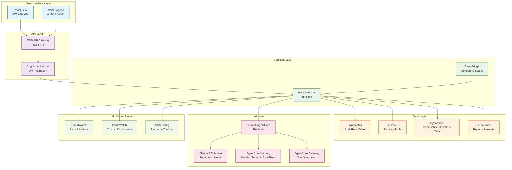
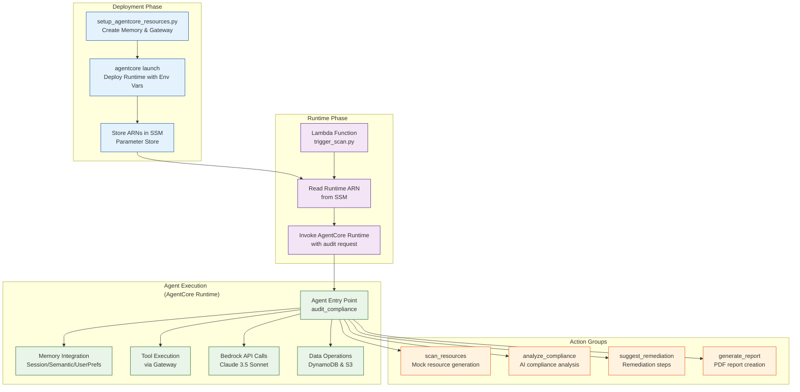
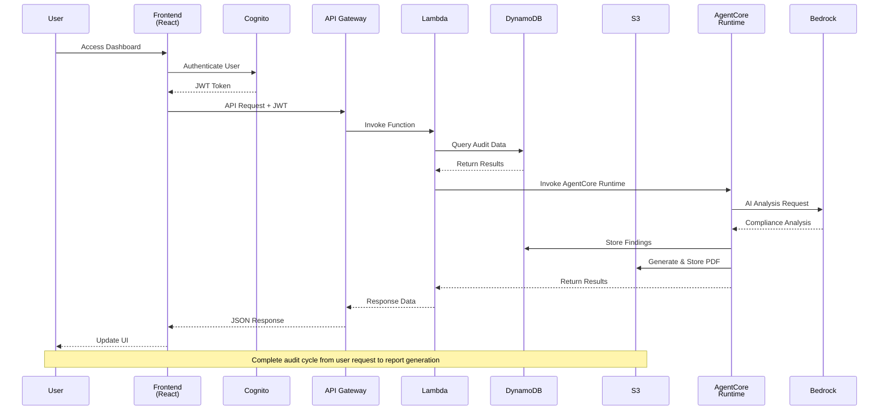

# SecureAuditAI Agent

## Autonomous AI-Powered Cybersecurity Compliance Auditing Platform

SecureAuditAI Agent is a comprehensive, serverless cybersecurity compliance auditing platform that leverages Amazon Bedrock's Claude 3.5 Sonnet model to provide autonomous, intelligent compliance monitoring and reporting across multiple regulatory frameworks including GDPR, SOC 2, and PCI-DSS.

[](https://aws.amazon.com/serverless/)
[](https://aws.amazon.com/bedrock/)
[](https://reactjs.org/)
[](https://www.typescriptlang.org/)
[](https://www.python.org/)

## Features

### Core Capabilities
- **Autonomous Compliance Auditing**: AI-powered analysis of AWS resources against compliance frameworks
- **Multi-Framework Support**: GDPR, SOC 2, PCI-DSS compliance checking with framework-specific rules
- **Intelligent Findings**: Prioritized risk assessment with actionable remediation steps
- **Automated Report Generation**: Professional PDF reports with executive summaries and detailed findings
- **Real-time Dashboard**: Interactive React dashboard with compliance metrics and trends
- **Secure Authentication**: AWS Cognito integration for user management and access control

### Technical Features
- **Serverless Architecture**: Zero idle cost with AWS Lambda, API Gateway, DynamoDB, and S3
- **Amazon Bedrock Integration**: Advanced AI reasoning using Claude 3.5 Sonnet via Bedrock AgentCore
- **Bedrock AgentCore Runtime**: Enterprise-grade agent orchestration with memory, tools, and gateway integration
- **RESTful API**: Comprehensive API for audit management, findings retrieval, and status updates
- **CloudWatch Monitoring**: Built-in logging, metrics, custom dashboards, and alerting
- **Event-Driven Scanning**: Automated scheduled compliance scans via EventBridge rules

## Architecture

### System Architecture Overview



### AgentCore Architecture



### Data Flow Architecture



## Technology Stack

### Frontend
- **React 18.2.0** with TypeScript 4.9.0
- **AWS Amplify** for hosting and authentication
- **Tailwind CSS** for styling
- **React Router** for navigation
- **AWS Amplify UI** components

### Backend
- **Python 3.11+** for Lambda functions and AgentCore runtime
- **AWS Lambda** for serverless compute
- **Amazon Bedrock AgentCore** for AI orchestration
- **Claude 3.5 Sonnet** foundation model
- **Boto3** for AWS SDK integration

### Infrastructure
- **AWS CloudFormation** for infrastructure as code
- **Amazon DynamoDB** for NoSQL data storage
- **Amazon S3** for object storage
- **AWS API Gateway** for REST API management
- **AWS Cognito** for authentication and authorization
- **Amazon CloudWatch** for monitoring and logging
- **AWS EventBridge** for scheduled events

### Development Tools
- **Docker** for containerization
- **GitHub Actions** for CI/CD
- **ESLint** and **Prettier** for code quality
- **pytest** for testing
- **ReportLab** for PDF generation

## Prerequisites

### Core Requirements
- AWS Account with appropriate permissions for CloudFormation, Lambda, Bedrock, and related services
- Node.js 18+ and npm for frontend development
- Python 3.11+ for Lambda functions and AgentCore runtime
- Docker for AgentCore runtime containerization
- Git for version control

### GitHub OIDC Authentication Setup
GitHub Actions uses OIDC to authenticate with AWS (no access keys stored in GitHub):

1. **Create OIDC Identity Provider in AWS IAM**:
   ```bash
   aws iam create-open-id-connect-provider \
     --url https://token.actions.githubusercontent.com \
     --thumbprint-list 6938fd4d98bab03faadb97b34396831e3780aea1 \
     --client-id-list sts.amazonaws.com
   ```

2. **Create IAM Role for GitHub Actions**:
   ```bash
   # Edit oidc-trust-policy.json with your GitHub org/repo details
   # Replace ${AWS_ACCOUNT_ID}, ${GITHUB_ORG}, and ${REPO_NAME}

   aws iam create-role \
     --role-name personal-github-oidc-role \
     --assume-role-policy-document file://oidc-trust-policy.json
   ```

3. **Attach deployment permissions policy** to the role:
   ```json
   {
     "Version": "2012-10-17",
     "Statement": [
       {
         "Effect": "Allow",
         "Action": [
           "cloudformation:*",
           "lambda:*",
           "apigateway:*",
           "cognito-idp:*",
           "cognito-identity:*",
           "dynamodb:*",
           "s3:*",
           "bedrock:*",
           "ecr:*",
           "logs:*",
           "events:*",
           "iam:GetRole",
           "iam:PassRole"
         ],
         "Resource": "*"
       }
     ]
   }
   ```

4. **Add AWS Account ID to GitHub Secrets**:
   - Repository Settings → Secrets and variables → Actions
   - Add `AWS_ACCOUNT_ID` secret with your AWS account ID

**Note**: No AWS access keys are needed - GitHub Actions will use OIDC to assume the appropriate IAM roles automatically.

### Automated Lambda Packaging
Lambda functions are automatically packaged and deployed:

- **Separate Lambda folder** (`lambda/`) contains all function code
- **Automatic packaging** during GitHub Actions deployment
- **S3-based deployment** packages uploaded to dedicated S3 bucket
- **Full CRUD APIs** for audit runs and findings management

### Cognito Domain Auto-Generation
The GitHub Actions workflow automatically generates unique Cognito domain prefixes:

- **No manual domain selection required** - domains are generated and validated automatically during deployment
- **Reuses existing domains** for the same stack/environment to avoid conflicts
- **Globally unique validation** ensures no domain conflicts
- **Format**: `{cleaned-stack-name}-{random-suffix}` (e.g., `secureauditai-agent-dev-a1b2`)
- **Retry logic** attempts up to 5 times to find an available domain

## 🚀 Quick Start

### 1. Deploy Infrastructure

```bash
# Deploy using GitHub Actions workflow (recommended)
The deployment workflow will automatically generate a unique Cognito domain prefix.

For manual deployment (not recommended), you would need to provide a unique domain:

```bash
# Manual deployment (domain must be pre-validated as unique)
aws cloudformation create-stack \
  --stack-name secureauditai-agent \
  --template-body file://cloudformation/template.yaml \
  --parameters \
    ParameterKey=Environment,ParameterValue=dev \
    ParameterKey=BedrockModelId,ParameterValue=amazon.titan-text-premier-v1:0 \
    ParameterKey=CognitoDomainPrefix,ParameterValue="your-validated-unique-domain"

# Wait for stack creation to complete
aws cloudformation wait stack-create-complete --stack-name secureauditai-agent
```

**Note**: The recommended approach is to use the GitHub Actions workflow, which automatically generates and validates unique domain prefixes.

### 2. Test Production Deployment

After deployment, the application will be fully functional with:

- **Professional Modern UI**: Complete redesign with modern design system
- **Full Authentication**: Sign up and sign in functionality
- **Responsive Design**: Works on desktop, tablet, and mobile devices
- **Production Builds**: Optimized builds for production deployment

**Testing Checklist**:
- [ ] Navigate to the deployed Amplify URL
- [ ] Click "Create Account" and sign up with email
- [ ] Check email for verification code and complete signup
- [ ] Sign in with your new account
- [ ] Test all navigation links (Dashboard, Audit Control, Findings, Reports)
- [ ] Verify responsive design on mobile devices
- [ ] Test user menu and sign out functionality

### 3. Build and Deploy Frontend

```bash
cd frontend
npm install
npm run build

# Deploy to Amplify (recommended for production)
# The GitHub Actions workflow automatically handles frontend deployment

# Alternative: Manual S3 deployment
aws s3 sync build/ s3://secureauditai-frontend-dev --delete
```

### 3. Configure AgentCore Runtime

```bash
cd agent
pip install -r requirements.txt

# Build and push Docker image to ECR (created by CloudFormation)
aws ecr get-login-password --region us-west-2 | docker login --username AWS --password-stdin <ECR_REPO_URI>
docker build -t secureauditai-agent .
docker tag secureauditai-agent:latest <ECR_REPO_URI>:latest
docker push <ECR_REPO_URI>:latest
```

### 4. Create AgentCore Runtime

```python
import boto3

# Create AgentCore runtime using CloudFormation outputs
agentcore_client = boto3.client('bedrock-agentcore-control')

response = agentcore_client.create_agent_runtime(
    name='SecureAuditAI-Agent',
    description='AI-powered compliance auditing agent',
    imageUri='<ECR_REPO_URI>:latest',
    executionRoleArn='<AGENTCORE_EXECUTION_ROLE_ARN>',  # From CloudFormation
    environmentVariables={
        'ENVIRONMENT': 'dev',
        'BEDROCK_MODEL_ID': 'amazon.titan-text-premier-v1:0'
    }
)
```

### 4. Authentication Setup

After deployment, create a Cognito test user:

```bash
# Get User Pool ID from CloudFormation outputs
USER_POOL_ID=$(aws cloudformation describe-stacks --stack-name secureauditai-agent \
  --query 'Stacks[0].Outputs[?OutputKey==`UserPoolId`].OutputValue' --output text)

# Create a test user
aws cognito-idp admin-create-user \
  --user-pool-id $USER_POOL_ID \
  --username test@example.com \
  --temporary-password TempPass123! \
  --message-action SUPPRESS \
  --user-attributes Name=email,Value=test@example.com Name=email_verified,Value=true

# Set permanent password
aws cognito-idp admin-set-user-password \
  --user-pool-id $USER_POOL_ID \
  --username test@example.com \
  --password SecurePass123! \
  --permanent
```

## 🔐 Authentication & Security

### User Authentication
- **AWS Cognito Integration**: Secure user authentication with email/password
- **Automatic Configuration**: Frontend automatically configured with CloudFormation outputs
- **Protected Routes**: All dashboard routes require authentication
- **Session Management**: Automatic token refresh and session handling

### Security Features
- **JWT Authorization**: API Gateway validates Cognito JWT tokens
- **Least Privilege IAM**: Lambda functions have minimal required permissions
- **Encryption**: Data encrypted at rest (DynamoDB, S3) and in transit
- **CloudTrail Logging**: All API calls and resource changes are logged

## 🛠️ Development

### Local Development Setup

1. **Frontend Development**:
```bash
cd frontend
npm install
npm start  # Runs on http://localhost:3000
```

2. **Lambda Functions**:
```bash
cd lambda
pip install -r ../requirements.txt
# Edit functions and test locally
```

3. **AgentCore Runtime**:
```bash
cd agent
pip install -r requirements.txt
python main.py  # For local testing
```

## Project Structure

```
├── agent/                          # Bedrock AgentCore runtime
│   ├── main.py                     # Agent entry point with BedrockAgentCoreApp
│   ├── compliance_analyzer.py      # AI compliance analysis engine
│   ├── mock_data_generator.py      # Mock AWS resource generator
│   ├── report_generator.py         # PDF report generation utilities
│   ├── setup_agentcore_resources.py # AgentCore infrastructure setup
│   ├── Dockerfile                  # Container definition for ECR
│   └── requirements.txt            # Python dependencies
├── lambda/                         # API Lambda functions
│   ├── trigger_scan.py             # Scan orchestration and AgentCore invocation
│   ├── api_audit_runs.py           # CRUD operations for audit runs
│   └── api_findings.py             # Findings management API
├── frontend/                       # React SPA application
│   ├── src/
│   │   ├── App.tsx                 # Main application component
│   │   ├── aws-exports.js          # Amplify configuration (generated)
│   │   ├── components/             # Reusable UI components
│   │   │   ├── AuthWrapper.tsx     # Authentication wrapper
│   │   │   ├── Navigation.tsx      # Main navigation component
│   │   │   └── ui/                 # UI component library
│   │   ├── pages/                  # Page components
│   │   │   ├── Dashboard.tsx       # Main dashboard
│   │   │   ├── AuditControl.tsx    # Scan configuration
│   │   │   ├── Findings.tsx        # Findings management
│   │   │   └── Reports.tsx         # Report generation
│   │   ├── services/               # API service layer
│   │   │   └── api.ts              # API client utilities
│   │   └── utils/                  # Utility functions
│   ├── build/                      # Production build artifacts
│   ├── package.json                # Node.js dependencies
│   └── tailwind.config.js          # Tailwind CSS configuration
├── cloudformation/                 # Infrastructure as Code
│   └── template.yaml               # Main CloudFormation template
├── scripts/                        # Deployment and utility scripts
│   └── configure-frontend.js       # Frontend configuration script
├── utils/                          # Shared utilities
├── requirements.txt                # Lambda function dependencies
├── oidc-trust-policy.json          # GitHub OIDC trust policy
├── ARCHITECTURE.md                 # Detailed architecture documentation
├── AGENTCORE_ARCHITECTURE.md       # AgentCore-specific documentation
├── DEMO_SCRIPT.md                  # Demo walkthrough script
├── LICENSE                         # Project license
└── README.md                       # This file
```

## API Reference

### REST API Endpoints

The SecureAuditAI API provides RESTful endpoints for managing compliance audits and findings. All endpoints are secured with AWS Cognito JWT authentication.

#### Audit Runs Endpoints
- `GET /audit-runs` - List all audit runs with optional filtering by status and date range
- `POST /audit-runs` - Create a new audit run (internal use)
- `GET /audit-runs/{auditRunId}` - Get specific audit run details
- `PUT /audit-runs/{auditRunId}` - Update audit run status and metadata
- `DELETE /audit-runs/{auditRunId}` - Delete an audit run

#### Findings Endpoints
- `GET /findings` - List findings with filtering by severity, audit run, resource type, and status
- `POST /findings` - Create a new finding (internal use)
- `GET /findings/{findingId}` - Get specific finding details
- `PUT /findings/{findingId}` - Update finding status and remediation notes
- `DELETE /findings/{findingId}` - Delete a finding

#### Scan Endpoints
- `POST /scan` - Trigger a new compliance scan with specified frameworks and configuration

### Authentication

All API endpoints require a valid Cognito JWT access token in the Authorization header:

```bash
curl -H "Authorization: Bearer <ACCESS_TOKEN>" \
     -H "Content-Type: application/json" \
     https://your-api-gateway-url.execute-api.region.amazonaws.com/stage/audit-runs
```

### Request/Response Format

API requests and responses use JSON format. All timestamps follow ISO 8601 format.

#### Example: Trigger Compliance Scan
```bash
curl -X POST \
  https://your-api-gateway-url.execute-api.region.amazonaws.com/stage/scan \
  -H "Authorization: Bearer <ACCESS_TOKEN>" \
  -H "Content-Type: application/json" \
  -d '{
    "complianceFrameworks": ["GDPR", "SOC2", "PCI-DSS"],
    "scanConfig": {
      "regions": ["us-east-1", "us-west-2"],
      "resourceTypes": ["S3", "EC2", "IAM", "Lambda"]
    }
  }'
```

#### Example: List Findings
```bash
curl -X GET \
  "https://your-api-gateway-url.execute-api.region.amazonaws.com/stage/findings?severity=CRITICAL&limit=50" \
  -H "Authorization: Bearer <ACCESS_TOKEN>"
```

## Security & Compliance

### Security Architecture

SecureAuditAI Agent implements a comprehensive security model designed to protect sensitive compliance data and ensure regulatory compliance.

#### Authentication & Authorization
- **AWS Cognito Integration**: User authentication with email/password and social providers
- **JWT Token Validation**: API Gateway validates Cognito-issued JWT tokens
- **Role-Based Access Control**: User roles determine access to audit functions and findings
- **Session Management**: Automatic token refresh and secure session handling

#### Data Protection
- **Encryption at Rest**: AES-256 encryption for DynamoDB tables and S3 buckets using AWS managed keys
- **Encryption in Transit**: TLS 1.3 encryption for all data transmissions
- **Private S3 Buckets**: All S3 buckets configured with public access blocking
- **VPC Endpoints**: Secure access to AWS services without public internet exposure

#### Infrastructure Security
- **Least Privilege IAM**: Lambda functions and services use minimal required permissions
- **CloudFormation Security**: Infrastructure deployed with security best practices
- **Resource Policies**: API Gateway and S3 buckets protected with resource policies
- **Security Groups**: Network-level security controls (where applicable)

#### Compliance Frameworks
- **GDPR Compliance**: Data protection and privacy controls
- **SOC 2 Compliance**: Security, availability, and confidentiality controls
- **PCI-DSS Compliance**: Payment card industry data security standards

### Audit Trail & Monitoring
- **CloudTrail Integration**: Complete audit trail of all AWS API calls and resource changes
- **CloudWatch Logs**: Centralized logging for Lambda functions and API Gateway
- **Custom Dashboards**: Real-time security metrics and compliance monitoring
- **Automated Alerts**: Configurable alerts for security events and compliance violations

## 📈 Monitoring & Observability

- **CloudWatch Dashboard**: Real-time compliance metrics and trends
- **Custom Alarms**: Automated alerts for critical findings
- **Log Aggregation**: Centralized logging across all components
- **Performance Metrics**: Lambda duration, error rates, and throughput

## Cost Optimization

SecureAuditAI Agent leverages AWS serverless services for optimal cost efficiency and automatic scaling.

### Serverless Cost Model

#### Compute Costs
- **AWS Lambda**: $0.20 per 1M requests + $0.0000166667 per GB-second
  - Free tier: 1M requests + 400,000 GB-seconds per month
- **Amazon Bedrock**: $0.003 per 1K input tokens, $0.015 per 1K output tokens
  - Claude 3.5 Sonnet pricing (as of 2024)

#### Data Storage Costs
- **Amazon DynamoDB**: $1.25 per GB stored + $1.25 per million write request units
  - Free tier: 25 GB storage + 200 million requests per month
- **Amazon S3**: $0.023 per GB stored + $0.09 per GB transferred
  - Free tier: 5 GB storage + 20,000 GET requests per month

#### API & Networking Costs
- **API Gateway**: $3.50 per million requests
  - Free tier: 1 million requests per month
- **CloudWatch Logs**: $0.50 per GB ingested
  - Free tier: 5 GB ingested per month

### Cost Optimization Strategies

#### Usage-Based Pricing
- **No idle costs**: Pay only for actual scan executions and API calls
- **Automatic scaling**: Resources scale with demand without manual intervention
- **Free tier utilization**: Extensive use of AWS free tiers for development

#### Efficient Resource Usage
- **Optimized Lambda functions**: Appropriate memory allocation and timeout settings
- **Batch processing**: Efficient data processing patterns reduce API calls
- **Caching strategies**: Response caching reduces redundant computations

### Estimated Costs

#### Development Environment
- **Monthly cost**: $2-8
- **Primary usage**: Lambda executions, DynamoDB storage, API Gateway requests
- **Free tier coverage**: ~90% of development costs

#### Production Environment (Moderate Usage)
- **Monthly cost**: $15-50
- **Assumptions**: 100 scans/month, 10,000 API requests, 10 GB storage
- **Scaling**: Costs scale linearly with usage

### Cost Monitoring

Monitor costs using:
- **AWS Cost Explorer**: Analyze spending patterns and identify optimization opportunities
- **CloudWatch Billing Alarms**: Set up alerts for unexpected cost increases
- **AWS Budgets**: Define cost budgets with automated notifications

## 🧪 Testing

### Running Tests

```bash
# Frontend tests
cd frontend
npm test

# Lambda function tests
cd lambda
python -m pytest

# AgentCore integration tests
cd agent
python -m pytest tests/
```

### Manual Testing

1. **Start a Compliance Scan**:
   - Navigate to Audit Control page
   - Configure scan parameters
   - Click "Start Compliance Scan"

2. **Review Findings**:
   - Go to Findings page
   - Filter by severity or resource type
   - Update finding status

3. **Generate Report**:
   - Visit Reports page
   - Click "Generate Report"
   - Download PDF when ready

## 🚨 Troubleshooting

### Common Issues

**AgentCore Runtime Not Starting**:
- Check ECR repository exists and image is pushed
- Verify IAM execution role has correct permissions
- Check CloudWatch logs for error details

**API Gateway 403 Errors**:
- Ensure Cognito user pool is correctly configured
- Verify JWT token format and expiration
- Check API Gateway authorizer settings

**Bedrock Access Denied**:
- Confirm Bedrock model access in AWS console
- Check IAM permissions for bedrock:InvokeModel
- Verify model ID is correct and available in region

## 📚 Additional Resources

- [Amazon Bedrock Documentation](https://docs.aws.amazon.com/bedrock/)
- [Bedrock AgentCore SDK](https://github.com/aws/bedrock-agentcore-sdk-python)
- [AWS Serverless Best Practices](https://aws.amazon.com/serverless/)
- [React + TypeScript Guide](https://react-typescript-cheatsheet.netlify.app/)

## 🤝 Contributing

1. Fork the repository
2. Create a feature branch (`git checkout -b feature/amazing-feature`)
3. Commit your changes (`git commit -m 'Add amazing feature'`)
4. Push to the branch (`git push origin feature/amazing-feature`)
5. Open a Pull Request

## License

This project is licensed under the **Creative Commons Attribution-NonCommercial 4.0 International License (CC BY-NC 4.0)**.

### Permitted Use
- **Educational Use**: Academic research, coursework, and learning projects
- **Personal Projects**: Individual development and portfolio projects
- **Non-Commercial Research**: Research institutions and non-profit organizations
- **Open Source Contributions**: Contributions to other open-source projects

### Restrictions
- **Commercial Use**: Any commercial software development, services, or business applications
- **For-Profit Activities**: Any use intended for commercial advantage or financial gain
- **Commercial Distribution**: Sale, licensing, or distribution for commercial purposes

### Requirements
- **Attribution**: Provide appropriate credit and indicate if changes were made
- **Non-Commercial**: Use must not be primarily intended for commercial advantage
- **Share Alike**: Adapted works must be licensed under the same terms

For commercial licensing options or special permissions, please contact the project maintainers.

See the [LICENSE](LICENSE) file for the complete legal terms and conditions.

## 🙏 Acknowledgments

- Built with [Amazon Bedrock](https://aws.amazon.com/bedrock/)
- Powered by [Claude 3.5 Sonnet](https://anthropic.com/claude)
- Inspired by cybersecurity compliance challenges
- Thanks to the AWS serverless community

---

**Made with ❤️ for the hackathon community**
